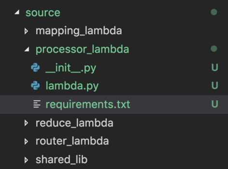

# Juniper: Tool to package lambda functions

Packaging of python lambda functions is a problem a web developer faces when
building web APIs using AWS services. The main issue is that the dependencies
of the function must be included along with the business logic of the function.

This is a minimal implementation of a packaging tool created with a single
purpose in mind: build a .zip artifact for a set of lambda functions.

This tool does not deploy or update a lambda function in AWS. This
tool is used to generate a set of .zip files contaning dependencies and
shared libraries, which you can upload yourself.

# Quickstart

With Python==3.6 and Docker installed, install juniper:

```
>>> git clone git@gitlab.devops.eab.com:Connect-Service/juniper.git
>>> cd juniper
>>> pip install -e .
```

Go to the code you are packaging and define a configuration for your functions, ex in `sample.yml`:

```yaml
functions:
  router:                                         # Name of the lambda function (result in router.zip artifact)
    requirements: ./src/router/requirements.txt.  # Path to reqs file
    include:
      - ./src/eablib/eab                          # Path for inclusion in code
      - ./src/router_function/router.             # Path for inclusion in code
```

Build it!

```
>>> motto build -c sample.yml
```

Your .zip is now in the `dist/` directory.  🎉

# Use cases

juniper is essential when generating a set of artifacts referenced by a SAM
template and used in conjunction with cloudformation package/deploy cli commands.
When using SAM to define the AWS resources, a developer must specify a local
reference for the zip file containing the source code of the function.

With this tool, a developer can easily generate the artifacts locally as a way to deploy
his changes (using cloudformation commands). Additionally, the tool needs to play
a role as a step in the CI/CD pipeline.

## Why?

Having full control of the tools a web developer uses is fundamental. While working
in the serverless domain, a developer must choose among the multiple turn-key
services offered by the frameworks in this domain. However, if the developer decides
to take full control of his own stack, resources, and definitions, installing
a framework like chalice or zappa is overkill when trying to generate .zip
artifacts.

The main advantage of this tool is its minimal implementation and flexibility. The
features that set this tool apart from the competition are:

* Minimal structure in the infrastructure file
* Ability to use well known docker image as a way to install dependencies
* Ability to include a set of local shared libraries
* Ability to package multiple lambda functions

## Microservices

When building microservices as lambda functions, having a set of functions in the
same repo is a desirable architectural proposition. This tool was born out of the need to build each function separately from one another.



With a folder structure like the above, creating a .zip per lambda
function is fundamental. The requirements of the router are different from the
requirements of the mapping functions, the artifact generated for each lambda
should reflect this.

Along this line of thought, the shared_lib could be used by the `mapping_lambda`,
the `processor` and the `reducer`. Being able to keep the shared lib in an independent
module is standard practice. For our packaging purposes, we only need to include the source
code of the shared lib only for the lambdas that depend on this common functionality.

The tools currently available in the serverless space do not acomodate these needs in a standard,
straight forward way.

## What?

This tool was created to package a given set of lambda functions. The packaging
of a lambda function consists of the following steps:

1. pip install dependencies
2. combine lambda's code with it's dependencies
3. include additional local shared libraries
4. generate a `.zip` artifact with these files

For the tool to know what it needs to package, the functions as well as it's
dependent components must be defined in a `.yml` file. The file must include
these pieces of information:

* name of the lambda function
* local path to the requirements.txt file.
* local path to shared code

# YAML Definition
The input file definition for this tools takes a minimalist form. In a nutshell
the tools need to know the name of the function to package, the path to the
`requirements.txt` file and a list of include definitions. An example file is provided
in the source of this project.

```yaml
functions:
  router:
    requirements: ./src/router/requirements.txt
    include:
      - ./src/eablib/eab
      - ./src/router_function/router
```

The name of the function will be used as the name of the zip file produced by the tool.
If your function is called `router`, after executing the tool, a `router.zip` file
will be added in your `./dist` folder.

# Usage
First of all clone this project and pip install it into your virtual environment.

    >>> git clone git@gitlab.devops.eab.com:Connect-Service/juniper.git
    >>> cd juniper
    >>> pip install -e .

Once you have the tool installed, go to the project you're currently working and create
a motto definition file. Call the file something like `sls.yml`. Use the `sample.yml`
as a starting point on how to define your functions.

Once you have the definitions file as part of your project. You can build your
lambda functions using the following command:

    >>> motto build -c sls.yml

After executing the command, you will see an output similar to the one on this
screenshot:


# Value proposition
When working with lambda functions in python, there are multiple ways to generate
the .zip artifact. As previously stated, there three main players in the serverless
framework space: Chalice, Zappa and the Serverless Framework. These solutions are
very comprehensive and offer a wide range of features including building, deploying,
spinning up local development servers, etc.

Keep in mind that these offerings are either web frameworks or framework wrappers and their
value proposition is completely different from juniper's. A framework is a
comprehensive offering with 100s of features on top of packaging.

>>>
juniper is only used for generating the artifacts required to deploy a python
lambda function. This tool can be used in conjunction with pretty much any framework
in the serverless space.
>>>

In the following sections, we take a look at the advantages and disadvantages of using this
solution as compared to existing tools; as related to building `.zip` artifacts.

## SAM
[SAM](https://aws.amazon.com/serverless/sam/) is the absolute standard to build and
deploy lambda functions. The tool is in it's early stage and it does a very good
job at addressing the building, packaging and deployment of AWS lambda functions.
However, the drawbacks of this tool as it stands today are:

* Inability to create a single .zip artifact per function
* No standard way to include shared logic among multiple lambdas
* Heavy reliance on the sam.yml template (not a bad thing in it's own way)

>>>
If SAM was to support these three features, there would be absolutely no need for
juniper to exist. For the use cases in which these features are **NOT** a necesity,
it is recommended to use SAM for building the .zip artifact.
>>>

## Chalice
[Chalice](https://github.com/aws/chalice) is a microframework built by an AWS team
with two goals in mind: to have a very small footprint, and to streamline the
development of serverless APIs. For several use cases, the offerings and features
of Chalice are sufficient.  However, as a serverless project evolves, it's requirements
and expectations evolve with the project and Chalice starts falling short.

* Inability to create a single .zip artifact per function
* Packaging of multiple lambda functions accomplished by creating a single .zip artifact
* Very strict project structure, to fit packaging requirements (files **must** go here or there)
* Complicated to include lambdas of other runtimes (python along nodejs)
* Issue with third party dependencies that sometimes require the developer to include the third party library in the source code (`vendor` folder).

>>>
For POC projects and as a way to get an API up and running in no time with very
little concern on infrastructure, Chalice is a fantastic offering.
>>>

## Serverless Framework
[Serverless](https://serverless.com/) is a really comprehensive offering, it's
lightweight, it streamlines the build, configuration and deployment process of
lambda functions. It has the support of a large community, it rapidly evolves given its
plug-in architecture, and it offers a large set of features to get a developer up and running quickly and effectively.

The tool is mainly targeted towards the development of NodeJS based lambda functions.
It can be used to package lambda functions and it is flexible enough to support some
of the drawbacks outlined on the previous tools.

* Not ideal to have a nodejs based tool to build lambda functions
* If used only for packaging, a large number of dependencies are need to orchestrate the build process (again, not ideal)
* Inability to include local shared libraries in the package of individual functions


## Zappa
[Zappa](https://github.com/Miserlou/Zappa) was built as a way to port WSGI based
web frameworks to the serverless space. If you want to use `Django` or `Flask` or
any other web framework that you're familiar with, Zappa will make it happen!
If you don't need a large web framework in an AWS lambda, then using Zappa for the
building of lambda functions and generation of the .zip artifact could be overkill.

The feature set of Zappa is really comprehensive. Packaging is flexible
enough, but using Zappa as a packaging tool only is a counter productive offering.

* Configuration is complex (given its flexibility and large feature offering)
* Zappa is great if you want django in a lambda. Most of the time, you don't.
* Not trivial to create a .zip per lambda including shared code
