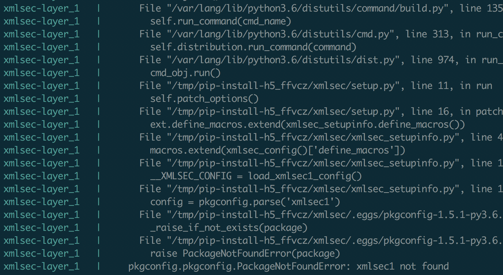

Layers and binaries
===================

In this section we are going to discuss how to use aws lambda layers and juniper
to package a lambda function that requires additional OS packages to be installed
in the build container.

For most use cases, the lambci container used by juniper has the dev system libraries
necesary to pip install a set of dependencies. However, when this is not the case,
you need to build a docker image with the missing dependencies that juniper can
use for build purposes.

TL;DR
*****
Look at the setup of juniper's examples/manywheels. The main takeaways are:

* Use a dockerfile to install missing OS libraries
* Use the lambci build images as the base image of the dockerfile
* If binaries need to be included in the final artifact, copy them explicitly
  to the **/var/task/lambda_lib/** folder. Juniper will know what to do with those
* Build new docker image locally (see the manywheels/Makefile) build command
* Use the locally built image in the juniper manifest (manywheels/manifest.yml)

Manywheels
**********
The manywheels example is a basic setup used to illustrate three things:

* How to use docker to build a image with missing dependencies
* How to use aws lambda layers
* How to include a set of binaries in zip artifact of the lambda function

To get started, make sure you clone the project and install juni:

    >>> git clone git@github.com:eabglobal/juniper.git
    >>> cd juniper
    >>> python3 -m venv venv
    >>> source venv/bin/activate
    >>> pip install -e .
    >>> cd examples/manywheels

This example will use a simple lambda function that has a dependency on the
xmlsec python library. Without the following steps, building a lambda function with
juniper with a requirements.txt file that has the xmlsec package fails with the
following error:

You can reproduce this error by commenting out this line in the manifest file:

.. code-block:: yaml

    layers:

      xmlsec:
        # image: juniper/xmlsec
        requirements: ./requirements/xmlsec_layer.txt

The `xmlsec documentation`_ clearly indicates that in order to install this python
package, a developer needs to have the following OS libraries:

    >>> yum install libxml2-devel xmlsec1-devel xmlsec1-openssl-devel libtool-ltdl-devel
    >>> pip install xmlsec

.. _`xmlsec documentation`: https://pythonhosted.org/xmlsec/install.html

Installing OS libraries
***********************
To install a set of libraries, create a new Dockerfile as follows:

.. code-block:: yaml

    FROM lambci/lambda:build-python3.6

    RUN yum install libxml2-devel xmlsec1-devel xmlsec1-openssl-devel libtool-ltdl-devel -y

    RUN mkdir -p /var/task/lambda_lib/
    RUN cp /usr/lib64/libxmlsec1-openssl.so /var/task/lambda_lib/
    RUN cp /usr/lib64/libxmlsec1.so.1 /var/task/lambda_lib/

This is the content of the /manywheels/docker/Dockerfile.xmlsec. To make sure that
your build artifact will be compatible with the lambda execution environment, we
recommend you use the **lambci/lambda:build-python3.6** as the starting point of
the docker file. Juniper uses this image by default.

The second part of the file copies two binaries that **must** be included in the
zip artifact of the lambda function for it to correctly function at run time. If
you ommit the copying of the *.so files to the lambda_lib directory, you function
will correctly generate a zip artifact, however, the function will **NOT** work
when you run it.

These two files are required by the xmlsec library only! Different dependencies have
different needs, you need to know and understand the needs of the library you are
trying to install and ultimate include in the artifact of the lambda function.

lambda_lib directory
********************
This is the folder that juniper uses to retrieve a set of binaries that need to
be included in the final artifact. The main reason to use this shared folder
is that the binaries go in different places depending on the type of resource
being built (lambda function/lambda layer).

docker build
************
With the given dockerfile created, add the following line to the makefile.

.. code-block:: yaml

    build:
        docker build -t juniper/xmlsec -f docker/Dockerfile.xmlsec .
        juni build

The makefile contains a set of utility functions used during the development process
to build, package and deploy a serverless project. The line above builds a local
docker image called juniper/xmlsec.

Use the name of the new image to build the lambda layer. The final manifest looks
like this:

.. code-block:: yaml

    functions:
      sample:
          requirements: ./requirements/base.txt
          include:
          - ./lambda_function.py

    layers:
      xmlsec:
          image: juniper/xmlsec
          requirements: ./requirements/xmlsec_layer.txt

With these changes you can now build and deploy the application using the commands
in the make file.

    >>> make build
    >>> make deploy
