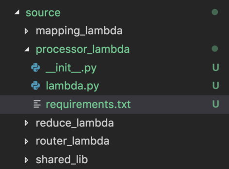

Concepts
========

Juniper is essential when generating a set of artifacts referenced by a SAM
template and used in conjunction with cloudformation package/deploy cli commands.
When using SAM to define the AWS resources, a developer must specify a local
reference for the zip file containing the source code of the function.

With this tool, a developer can easily generate the artifacts locally as a way to deploy
his changes (using cloudformation commands). Additionally, the tool needs to play
a role as a step in the CI/CD pipeline.

In this page we discuss the main reasons for creating Juniper. We also provide
a very basic survey of the tools available in the serverless space.

Packaging
*********

In this document, when talking about packaging a lambda function, what we're
referring to is the creation of a zip file as defined by the following steps:

1. pip install dependencies
2. combine lambda's code with it's dependencies
3. include additional local shared libraries
4. generate a `.zip` artifact with these files

manifest.yml
*************

For juniper to know what it needs to package, the functions as well as its
dependent components must be defined in a `.yml` file. The file must include
these pieces of information:

* name of the lambda function
* local path to the requirements.txt file.
* local path to shared code

The manifest file definition must include the above information. The definition
of a manifest for a single function looks like:

.. code:: yaml

    functions:

      router:
        requirements: ./src/router/requirements.txt
        include:
        - ./src/commonlib/common
        - ./src/router_function/router

juni build
**********

The core command of Juniper. This command by default will look for a file called
`manifest.yml` and it will generate a zip artifact for every function under the
functions block.

The build command uses docker compose as a way to provide a dependable and deterministic
artifact. Using docker and docker-compose validate that the artifact generated
in a local machine will be identical to the one generated as part of a CI/CD
pipeline.

To build a set of lambda functions:

    >>> juni build

After executing the command, you will see an output similar to:

.. image:: ../assets/build_cmd.png

If you would like to call the manifest file something else, you can specify the
name of the file as follows:

    >>> juni build -m sls.yml

Lambda Build Tool
=================

Juniper is a tool with a very well defined scope. Yes, it is another tool that
offers a developer the flexibility to easily define what goes into the zip files
he needs in order to deploy a lambda function. Nothing available would do, so we
built it!

Having full control of the tools a web developer uses is fundamental. While working
in the serverless domain, a developer must choose among the multiple turn-key
services offered by the frameworks in this domain. However, if the developer decides
to take full control of his own stack, resources, and definitions, installing
a framework like chalice or zappa for packaging purposes is an overkill.

Also, as you will see later on in this document, these offerings fall short of
providing a clear and straightforward answer to these business needs:

1. Package lambda independently
2. Include lambdas that are not python and generate a zip for them
3. Specify the requirements file for each lambda individually
4. Ability to include shared libs (local imports, packages not in pypi)

Microservices
=============

When building microservices as lambda functions, having a set of functions in the
same repo is a desirable architectural proposition. This tool was born out of the
need to build each function separately from one another.

Juniper shines, when the folder structure of your microservices is as follow:

As seen in the image above, each lambda function has its own module. With a folder
structure like the one above, creating a .zip per lambda function is fundamental.
Equally important is the ability of a tool to include shared libraries that are
relative to the your lambdas.

The shared lib could be used by the `mapping_lambda`, the `processor` lambda only.
Being able to keep the shared lib in an independent module is standard practice.
For our packaging purposes, we only need to include the source code of the shared
lib only for the lambdas that depend on this functionality.

The tools currently available in the serverless space do not acomodate these
needs in a standard, straight forward way. Hence the need to use a tool like Juniper.

Tool Survey
===========

When working with lambda functions in python, there are multiple ways to generate
the zip artifact. As previously stated, there are four main players in the serverless
framework space: SAM, Chalice, Zappa and the Serverless Framework. These solutions are
very comprehensive and offer a wide range of features including building, deploying,
spinning up local development servers, etc.

Keep in mind that these offerings are either web frameworks or framework wrappers and their
value proposition is completely different from juniper's. A framework is a
comprehensive offering with hundreds of features on top of packaging.

.. note::
    Juniper is only used for generating the artifacts required to deploy a python
    lambda function. This tool can be used in conjunction with pretty much any framework
    in the serverless space.

In the following sections, we take a look at the advantages and disadvantages of using this
solution as compared to existing tools; as related to building `.zip` artifacts. Keep in
mind that this is not a comprehensive review of each offering, however, these sections
are meant to show the capabilities and downsides of each tool as it relates to packaging
lambda functions.

Serverless Application Model (SAM)
**********************************

`SAM`_ is the standard used to define serverless applications in the AWS ecosystem.
SAM can also be used to build package and deploy lambda functions. Using this
standard to define your application is best practice.

However, the drawbacks of this tool as it stands today are:

* Inability to create a single .zip artifact per function
* No standard way to include shared logic among multiple lambdas
* Heavy reliance on the sam.yml template (not a bad thing in its own way)

If SAM were to support these three features, there would be absolutely no need for
juniper to exist. For the use cases in which these features are **NOT** a necessity,
it is recommended to use SAM for building the .zip artifact.

.. _SAM: https://aws.amazon.com/serverless/sam/

Chalice
*******

`Chalice`_ is a microframework built by an AWS team with two goals in mind:
to have a very small footprint, and to streamline the development of serverless
APIs. For several use cases, the offerings and features of Chalice are
sufficient.  However, as a serverless project evolves, its requirements
and expectations evolve with the project and Chalice starts falling short.

* Inability to create a single .zip artifact per function
* Packaging of multiple lambda functions accomplished by creating a single .zip artifact
* Very strict project structure, to fit packaging requirements (files **must** go here or there)
* It's rather complicated to include lambdas of other runtimes (e.g. python and nodejs)
* Issue with third party dependencies that sometimes require the developer to include the third party library in the source code (`vendor` folder).

For POC projects and as a way to get an API up and running in no time with very
little concern on infrastructure, Chalice is a fantastic offering. However, as
your project evolves, and the need to have more flexibility in terms of packaging,
chalice will fall short.

.. _Chalice: https://github.com/aws/chalice

Serverless Framework
********************

`Serverless`_ is a really comprehensive offering. It's lightweight and it
streamlines the build, configuration and deployment process of lambda functions.
It has the support of a large community, it rapidly evolves given its
plug-in architecture, and it offers a large set of features to get a developer
up and running quickly and effectively.

The tool is mainly targeted towards the development of **NodeJS** based lambda functions.
It can be used to package lambda functions and it is flexible enough to support some
of the drawbacks of the previous tools. We think its drawbacks are:

* Not ideal to have a nodejs based tool to build lambda functions
* If used only for packaging, a large number of dependencies are need to orchestrate
  the build process (again, not ideal)
* Inability to include local shared libraries in the package of individual functions

.. _Serverless: https://serverless.com/

Zappa
*****

`Zappa`_ was built as a way to port WSGI based web frameworks in the serverless
space. If you want to use `Django` or `Flask` or any other web framework that
you're familiar with. Write your django app, and let zappa take care of creating
lambda functions and API gateway endpoints for you.

When using zappa, the main question is: do I need an entire web framework in an AWS lambda?
If the answer is no, then using Zappa might not be appropriate for your use case.

The feature set of Zappa is really comprehensive and the packaging is flexible enough
to support plugins, custom callbacks and everything in between.

* Configuration is complex (given its flexibility and large feature offering)
* Zappa is great if you want django in a lambda. Most of the time, you don't.
* Not trivial to create a .zip per lambda including shared code

.. _Zappa: https://github.com/Miserlou/Zappa
